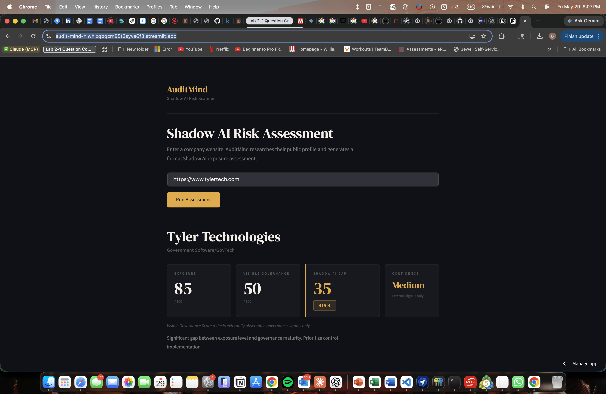
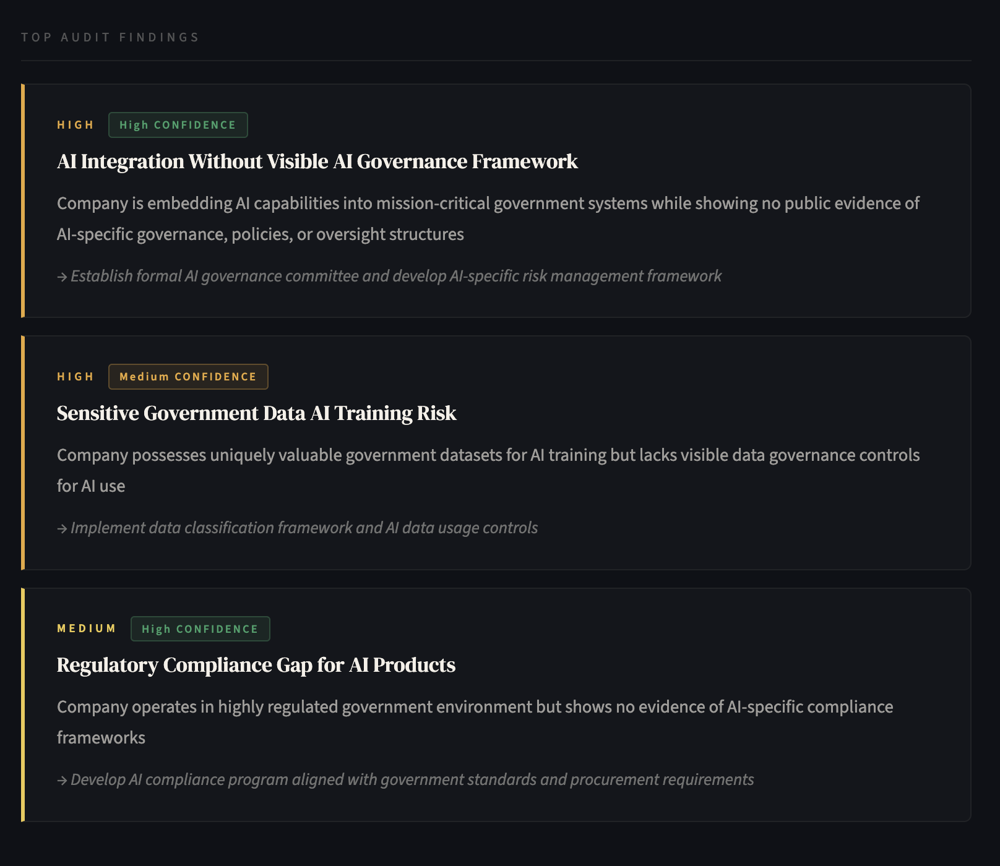
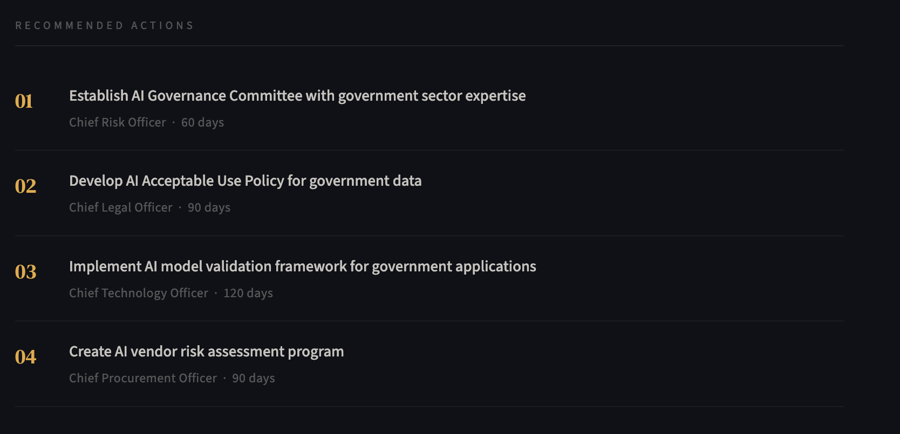
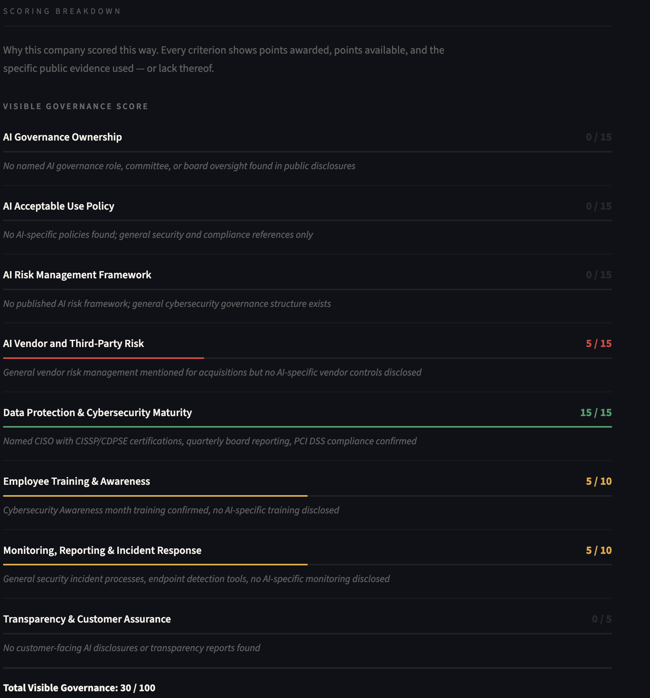

# AuditMind — Shadow AI Risk Scanner

> **Shadow AI** = employees using unauthorized AI tools (ChatGPT, Copilot, Gemini) with sensitive company data — no audit trail, no visibility, no controls. It's one of the fastest-growing blind spots in enterprise risk management.

AuditMind takes a company URL and generates a formal Shadow AI exposure assessment in seconds using Claude AI with live web search. Built for internal audit teams who need a fast, structured starting point before going internal.

**Live demo → [audit-mind-hiwhlxqbqcm85t3syva6f3.streamlit.app](https://audit-mind-hiwhlxqbqcm85t3syva6f3.streamlit.app)**

---

## What It Does

Enter a company website. AuditMind researches their public profile via live web search and scores them across two dimensions:

| Score | What It Measures |
|---|---|
| **Exposure Score (0–100)** | How much does this company need strong AI governance? Based on data sensitivity, regulatory environment, AI product presence, workforce distribution, and security incident history. |
| **Visible Governance Score (0–100)** | How much external evidence of AI governance exists? Named *Visible* deliberately — the tool only measures what is publicly observable. |
| **Shadow AI Gap** | Exposure minus Visible Governance. The wider the gap, the more urgent the internal audit question. |

**The full report includes:**
- Executive Summary — CFO/Board-level narrative
- Scoring Breakdown — every criterion scored with the specific public evidence cited, or explicitly flagged as not found
- Audit Findings — 3–5 findings in formal internal audit language with priority and confidence ratings
- Recommended Controls — with owner and timeline
- Audit Pack — department risk zones, 7 interview questions, 10 evidence requests ready to use
- PDF export

---

## Screenshots

**Score cards and executive summary**


**Audit findings in formal internal audit language**


**Recommended controls with owner and timeline**


**Full scoring breakdown — every criterion with cited evidence**


---

## Example Output — Tyler Technologies

Tyler Technologies is the largest pure-play government software company in the US, serving 44,000 government installations across courts, tax systems, and public safety agencies.

| | Score |
|---|---|
| Exposure | 85 / 100 |
| Visible Governance | 30–35 / 100 |
| Shadow AI Gap | ~50 — **High Risk** |
| Confidence | Medium |

Top finding: *AI Integration Without Visible AI Governance Framework* — the company is embedding AI into mission-critical government systems (Odyssey, EnerGov) with no publicly observable AI-specific governance, policies, or oversight structures.

Full sample report → [`docs/AuditMind_Tyler_Technologies_20260530.pdf`](docs/AuditMind_Tyler_Technologies_20260530.pdf)

---

## Peer Comparison — Government Software Sector

AuditMind was tested on four real companies in the government software sector (assessed April 2026):

| Company | Exposure | Visible Governance | Shadow AI Gap | Risk Level |
|---|---|---|---|---|
| Tyler Technologies | 85 | 35 | **50** | High |
| CentralSquare Technologies | 90 | 25 | **65** | Critical |
| Accela | 85 | 10 | **75** | Critical |
| OpenGov | 70 | 0 | **70** | Critical |

Every company in this peer group is building AI into systems that manage courts, public safety, tax records, and citizen services. None has strong visible governance keeping pace with that development.

Full methodology and analysis → [`docs/AuditMind_CaseStudy_v2.docx`](docs/AuditMind_CaseStudy_v2.docx)

---

## Why This Exists

Enterprise DLP tools catch data leaving the network. CASB tools monitor cloud app usage. But nothing gives an audit team a fast, structured starting point for scoping a Shadow AI review *before* they go internal.

This is that starting point.

Built after a VP of Internal Audit at a major government software company identified Shadow AI as his team's biggest concern — employees using unauthorized AI tools with sensitive government data, with zero visibility or controls in existing security infrastructure.

---

## Tech Stack

| Component | Detail |
|---|---|
| Language | Python |
| UI | Streamlit |
| AI | Anthropic API — `claude-sonnet-4-20250514` |
| Web Search | `web_search_20250305` tool (live, agentic) |
| PDF Export | ReportLab |
| Deployment | Streamlit Cloud |

The core of the app is an agentic tool-use loop — the model searches the web, processes results, and iterates until it has enough evidence to score and write the report. It's not a simple API call.

---

## Run Locally

```bash
# 1. Clone
git clone https://github.com/derrickhabibii/Audit-Mind.git
cd Audit-Mind

# 2. Install
pip install -r requirements.txt

# 3. Set API key
export ANTHROPIC_API_KEY="sk-ant-..."

# 4. Run
streamlit run app.py
```

App opens at `http://localhost:8501`. Test with `https://www.tylertech.com`.

---

## Limitations

Scores may vary slightly across runs — live web search retrieves different signals each session. The scoring rubric criteria are fixed; the evidence discovered varies. This is a documented characteristic of the prototype and an argument for why internal audit verification is always the necessary next step.

A low Visible Governance Score means limited external assurance, not confirmed internal control failure. A company with strong internal controls and a culture of limited public disclosure will score low. The confidence rating on each report communicates this directly.

---

## Documentation

- [`docs/AuditMind_CaseStudy_v2.docx`](docs/AuditMind_CaseStudy_v2.docx) — Full methodology, scoring rubric, and 4-company peer comparison
- [`docs/AuditMind_Tyler_Technologies_20260530.pdf`](docs/AuditMind_Tyler_Technologies_20260530.pdf) — Sample output report
- [`ONBOARD.md`](ONBOARD.md) — Project structure and setup
- [`PRD.md`](PRD.md) — Product requirements and roadmap

---

*Built by Derrick Chua Jingye | William Jewell College | May 2026*